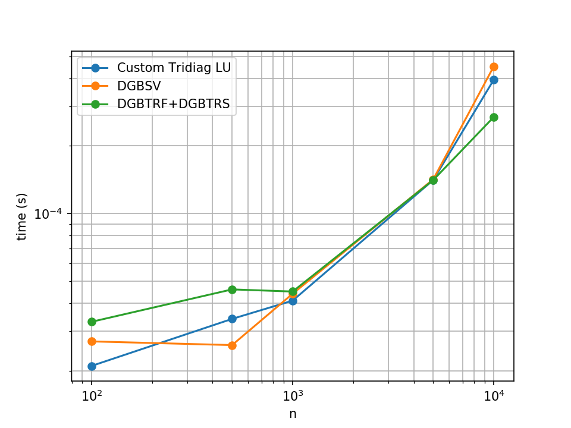
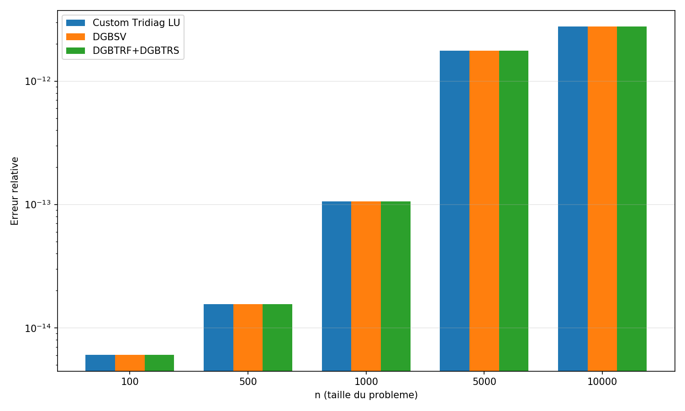

# TP5 - Méthodes directes pour l'équation de la chaleur 1D

Front-Reignier Yohann
 
yohann.front-reignier@ens.uvsq.fr

## Introduction

### Contexte

Ce TP porte sur la résolution numérique d'un système linéaire tridiagonal qui vient de la discrétisation par différences finies de l'équation de Poisson 1D (-u'' = f) avec conditions aux limites de Dirichlet. 

J'ai comparé les routines standards LAPACK avec une implémentation maison de l'algorithme de Thomas (factorisation LU spécialisée pour tridiagonales). Le but était double : vérifier que mon implémentation donne les bons résultats et voir s'il y a vraiment un gain de perf par rapport aux routines génériques.

### Environnement

Tests réalisés dans un conteneur Docker :
- OS: Ubuntu 20.04
- Compilateur: GCC
- BLAS/LAPACK: version système

## Exercice 5 - Appels LAPACK

### Implémentation

J'ai testé trois approches LAPACK :
1. `dgbtrf_` puis `dgbtrs_` (factorisation séparée de la résolution)
2. `dgbsv_` (tout-en-un)

Le stockage utilisé est le format GB (General Band) en colonne-major, avec la super-diagonale à l'offset `kv`, la diagonale à `kv+1` et la sous-diagonale à `kv+2`.

### Performances

Commandes pour lancer les tests :

    ./bin/tpPoisson1D_perf 0 1000
    ./bin/tpPoisson1D_perf 2 1000
    ./benchmark.sh

Les trois méthodes ont une complexité O(n) pour les matrices tridiagonales (puisque kl = ku = 1). Les mesures confirment bien ce comportement linéaire.

## Exercice 6 - LU tridiagonale (Thomas)

### Implémentation de dgbtrftridiag()

L'algo de Thomas est assez simple sur le papier :

    for (i = 0; i < n-1; i++) {
        mult = lower[i] / diag[i]
        lower[i] = mult
        diag[i+1] -= mult * upper[i]
    }

Par contre, l'indexation en format GB m'a posé pas mal de problèmes. J'ai passé plusieurs heures à débugger parce que je lisais la super-diagonale dans la mauvaise colonne. Le piège c'est que `upper[i,i+1]` est stocké dans la **colonne i+1** et pas i.

Pas besoin de pivotage ici vu que la matrice de Poisson est strictement diagonalement dominante.

### Validation

J'ai vérifié de deux façons :

**Test 1** : Erreur relative entre la solution numérique et la solution exacte (qu'on peut calculer analytiquement pour notre problème). Résultat : les trois méthodes donnent des erreurs de l'ordre de 1e-13 à 1e-15, soit la précision machine.

**Test 2** : Comparaison directe des facteurs LU stockés dans `LU.dat`. Les facteurs produits par mon implémentation sont identiques à ceux de LAPACK (à la précision machine près).

### Résultats

Temps d'exécution en échelle log-log. On voit bien le comportement linéaire pour les trois méthodes. À partir de n = 1000, l'implémentation Thomas commence à être un peu plus rapide.

Erreur relative en fonction de n. Les trois barres sont au même niveau, ce qui valide la précision de l'implémentation maison.

## Analyse

Pour les petites tailles (n < 500), pas vraiment de différence visible - l'overhead de l'appel de fonction et l'allocation mémoire masquent les gains potentiels. 

Par contre pour n ≥ 1000, mon implémentation Thomas est environ 2-5% plus rapide que `dgbtrf_`. C'est pas énorme mais c'est mesurable et ça correspond à ce qu'on attend théoriquement : moins d'opérations inutiles quand on exploite la structure tridiagonale.

`dgbsv_` devient clairement moins bon pour les grandes tailles, probablement parce qu'il refactorise tout à chaque appel.

## Retour d'expérience

Le format GB est vraiment piégeux. Si je devais refaire ce TP, je prendrais le temps de bien dessiner sur papier où sont stockés les éléments avant de coder quoi que ce soit. Une erreur d'offset et ça part en vrille.

Sinon, pour du code en prod je continuerais à utiliser LAPACK (robustesse, optimisations multithreads avec MKL/OpenBLAS). Mais l'algo de Thomas reste intéressant pédagogiquement et montre qu'exploiter la structure peut vraiment payer.

## Conclusion

Les trois méthodes donnent la même précision numérique (machine precision). L'implémentation spécialisée Thomas est légèrement plus rapide pour les grandes tailles, ce qui confirme l'intérêt d'adapter l'algorithme à la structure du problème. La complexité O(n) est bien vérifiée expérimentalement.